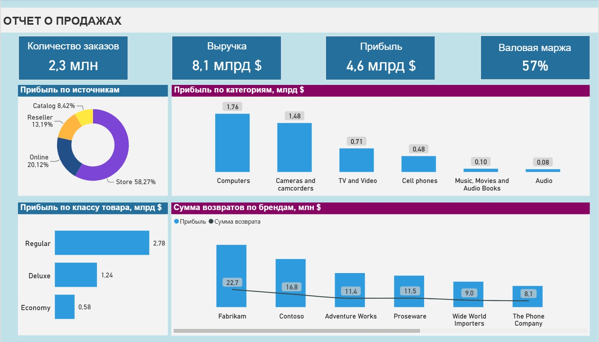
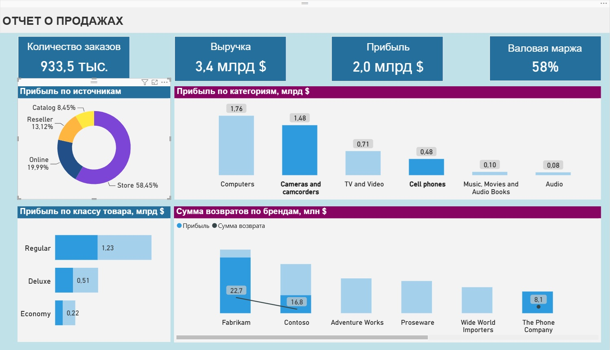
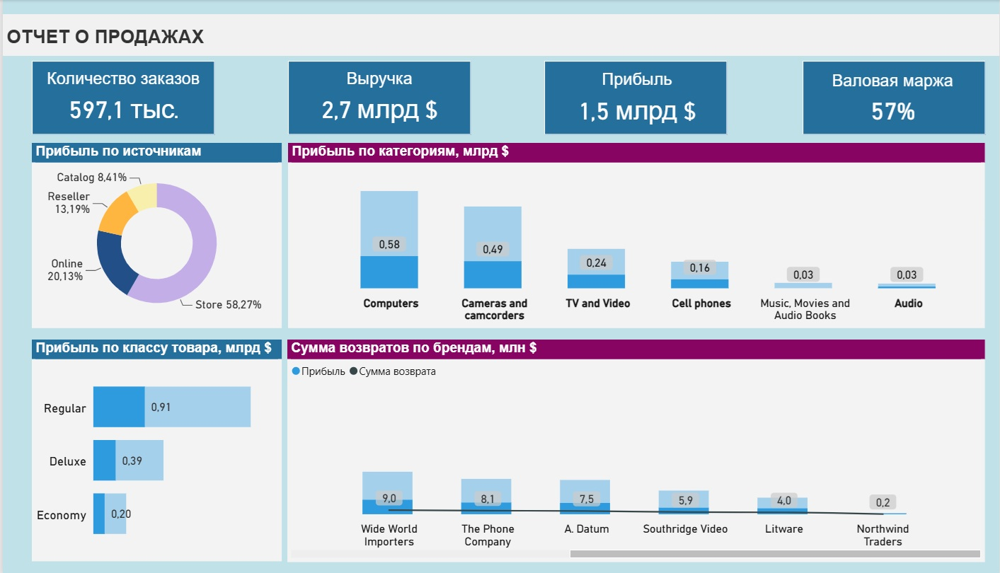

# Отчёт о продажах — дашборд в Power BI

Аналитический дашборд по продажам розничной сети на основе учебного датасета Contoso от Microsoft. Основные вопросы на которые должен ответить дашборд: сколько компания зарабатывает - выручка и расчет прибыли, на чем именно, и где именно наибольший процент потери от выручки из-за возвратах.



## Задачи 
Изучить и обработать полученные данные. Провести анализ и собрать отчёт для оценки прибыльности бизнеса. Для этого будет необходимо рассчитать следующие базовые метрики: общая чистая выручка, валовая прибыль, валовая маржа, количество заказов. Далее изучить источники продаж, самые и наименее прибыльные категории товаров, а также объём потерь от возвратов в разрезе брендов.

## Данные

- **Источник**: датасет Contoso (учебный датасет от Microsoft для тренировки Power BI)
- **Объём**: 2,3 млн заказов
- **Таблицы**: Sales, Product, ProductCategory, ProductSubcategory, Stores, Calendar, Channel, Geography, Promotion — связаны по схеме «звезда» где главной таблицей является Sales

## Что сделано

- Обработаны данные (удалены пустые строки, строки с неполными данными, дубликаты) через Power Query
- Построена модель данных: таблица фактов Sales связана с таблицами измерений по внешним ключам
- Добавлены DAX-меры для ключевых показателей: общая чистая выручка, валовая прибыль, валовая маржа, количество заказов, сумма возвратов — с корректным учётом возвратов и скидок (в себестоимости и выручке не учитываются возвращённые товары)
- Создан и настроен интерактивный дашборд: KPI-карточки с основными показателями, разбивка прибыли по категориям, анализ долей основных каналов продаж через круговую диаграмму, расчет прибыли по классу товара, отслеживание и сравнение прибыли и возвратов по брендам

## Создание и настройка дашборда

Ключевые показатели реализованы за счет KPI карточек с динамически вычисляемыми метриками. Всего их 4, а именно: количество всех заказов, чистая выручка, валовая прибыль валовая маржа. Для уменьшения визуальной нагрузки был подобран оттенок темно-синего, что позволяет хорошо выделить ключевые метрики на общем фоне, а также на нем хорошо заметен белый текст. 
Далее был реализована столбчатая диаграмма, которая отражает прибыль компании в разрезе категорий товаров из таблицы Product.  Для удобства просмотра для всех графиков и подписей используется шрифты без засечек и крючков, что позволяет лучше различать слова и увеличивает скорость чтения и не нагружает смотрящих лишней информацией. Все числовые значения были настроены по пользовательскому формату - в числах было уменьшено число разрядов, все значения представлены в тех единицах, которые указаны в заголовках. Человек, который будет анализировать данные с графика сможет быстро увидеть из заголовка единицы измерения, а значения состоящие не более чем из 4 цифр гораздо проще оценить - все это в совокупности делает график не нагруженным, удобным и интуитивно понятным. 



Аналогично был созданы графики показывающие прибыль по классу товаров и сумму возврата по брендам. В добавок в визуализации связанной с возвратами было решение использовать ползунок, что бы не увеличивать количество столбцов на одной диаграмме и не создавать большую визуальную нагрузку. Так данные не накладываются друг на друга и легко читаются. 
Круговая диаграмма отражает долю каждого источника продаж от общего числа заработка. Была выбрана именно круговая диаграмма по причине того что источников всего 4 что позволяет использовать именно круговую диаграмму так как она лучше всего позволяет человеку произвести визуальное сравнение. Для диаграммы были взяты хорошо различимые между собой цвета что позволяет хорошо видеть границы на графике каждого сектора. Из недостатков можно выделить что яркие цвета нагружают общую картину, но в угоду читабельности было решено пожертвовать уменьшением визуального шума и оставить данный вариант.



## DAX-меры (основные)

```dax
Выручка = SUM(Sales[SalesAmount])

Сумма возвратов = SUM(Sales[ReturnAmount])

Чистая выручка = [Выручка] - [Сумма возвратов]

Себестоимость = SUM(Sales[TotalCost])

Себестоимость возвратов = SUMX(Sales, Sales[ReturnQuantity] * Sales[UnitCost])

Чистая себестоимость = [Себестоимость] - [Себестоимость возвратов]

Валовая прибыль = [Чистая выручка] - [Чистая себестоимость]

Валовая маржа % = DIVIDE([Валовая прибыль], [Чистая выручка])
```

Полный список мер — в файле [dax_measures.md](dax_measures.md) *(добавь этот файл отдельно, если хочешь вынести все формулы)*.

## Инсайты

*(заполни своими выводами, например:)*
- Основной канал продаж — офлайн-магазины (58% прибыли), онлайн даёт только 20%
- Компьютеры и камеры — самые прибыльные категории, на них приходится основная доля прибыли
- Бренд Fabrikam лидирует и по прибыли, и по сумме возвратов — стоит проверить, не связаны ли частые возвраты с качеством товара или условиями продажи

## Инструменты

Power BI Desktop, Power Query, DAX, схема данных «звезда»

## Как посмотреть

1. Скачай файл `.pbix` из этого репозитория
2. Открой в Power BI Desktop (бесплатно с сайта Microsoft)

## Автор

*(твоё имя, ссылка на LinkedIn/резюме, если хочешь)*
